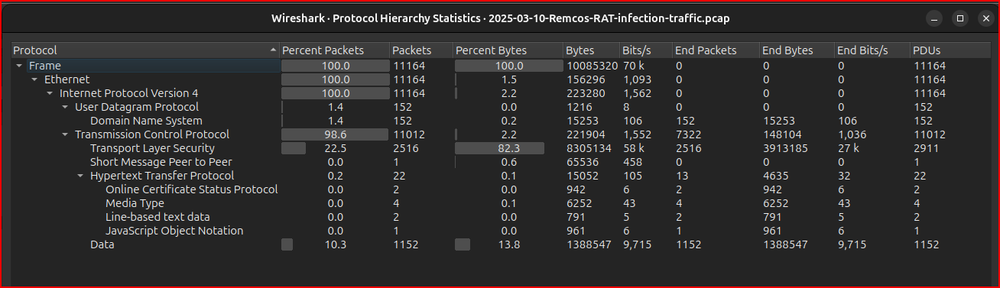
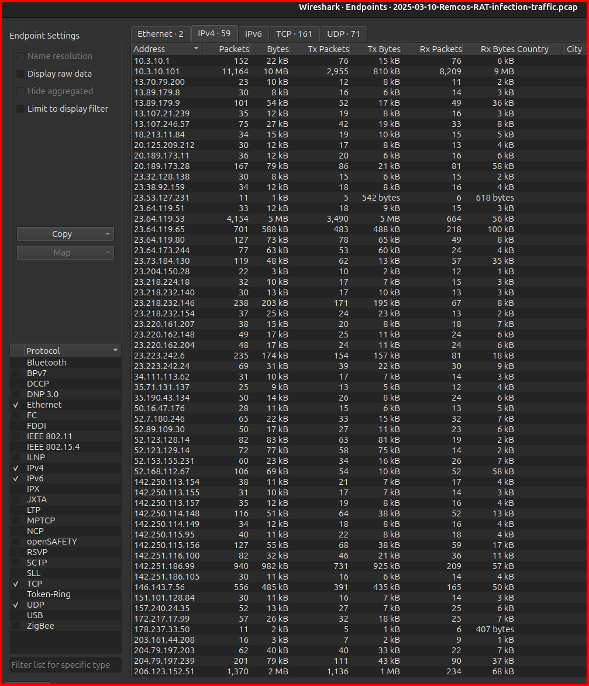

tcp.flags == 0x002

#### File Properties (meta data):
``` > Statistics -> Capture File Propterties ```


First Packet Capture at : 2025-03-10 23:48:04
Last Packet Capture at  : 2025-03-11 00:47:07
Elapsed time            : 00:19:03
Displayed Packets       : 104 


#### High-level triage using Wireshark statistics

##### ``` Protocol Hierarchy ```

``` > Statistics -> Protocol Hierarchy  ```




##### ``` Endpoints ```

``` > Statistics -> Endpoints  ```

